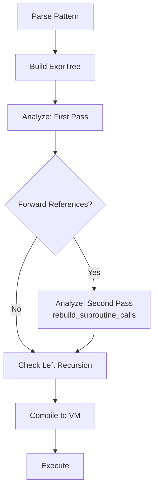
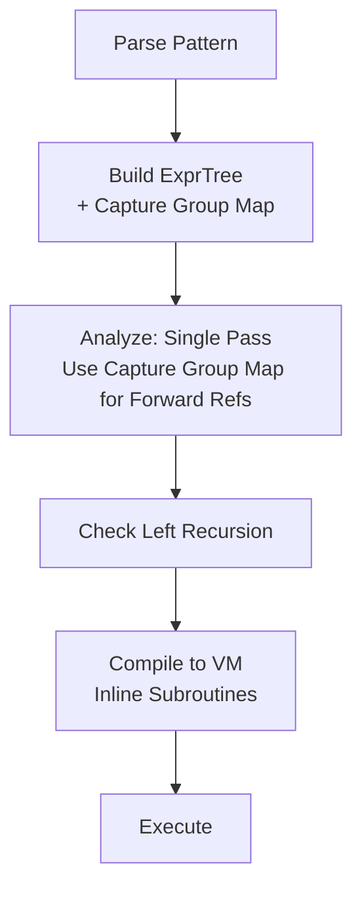
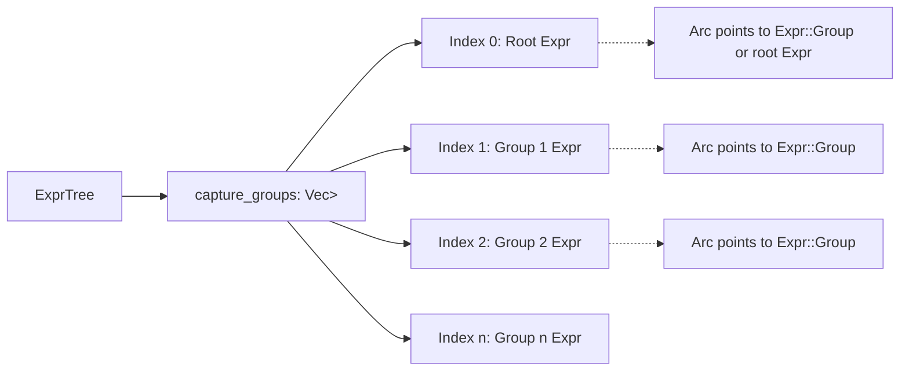
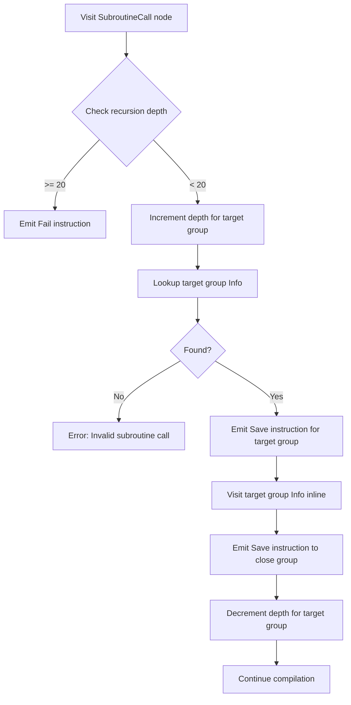

# Subroutine Call Implementation Plan

## Overview

This document outlines the implementation plan for improving subroutine call support in fancy-regex. The goal is to:
1. Eliminate the second pass in the analyzer by creating a capture group map on ExprTree
2. Implement full subroutine call support with recursion limits
3. Add support for the DEFINE group special syntax

## Background

### Current Architecture

The fancy-regex library uses a hybrid approach:
- **Parser** (`src/parse.rs`): Parses regex patterns into an Abstract Syntax Tree (AST) represented by `Expr` nodes
- **Analyzer** (`src/analyze.rs`): Analyzes the AST to determine properties like min_size, const_size, and whether backtracking is needed
- **Compiler** (`src/compile.rs`): Compiles the analyzed AST into VM instructions

### Current Issues

1. **Forward-referencing subroutines**: When a subroutine call `\g<2>` appears before group `(2)` is defined, the analyzer doesn't know the group's properties during the first pass. Currently, a second pass (`rebuild_subroutine_calls`) is triggered to fix this.

2. **Subroutine calls not implemented**: The compiler returns `FeatureNotYetSupported` for subroutine calls.

3. **No DEFINE group support**: The special `(?(DEFINE)...)` syntax is not implemented.

## Goals

1. **Add Capture Group Map to ExprTree**: Build a map/vector during parsing to reference `Expr::Group` nodes by capture group number
2. **Eliminate Second Pass**: Use the capture group map to immediately analyze forward-referenced groups
3. **Implement Subroutine Calls**: Compile subroutine calls into VM instructions with recursion depth tracking
4. **Add DEFINE Group Support**: Implement the special `(?(DEFINE)...)` syntax

## Implementation Phases

### Phase 1: Add Capture Group Map to ExprTree

**Goal**: Create a map on `ExprTree` that references each capture group's `Expr::Group` node, populated during parsing.

#### Changes Required

**File: `src/parse.rs`**

1. Add a capture group map field to `ExprTree`:
   ```rust
   pub struct ExprTree {
       pub expr: Expr,
       pub backrefs: BitSet,
       pub named_groups: NamedGroups,
       pub(crate) contains_subroutines: bool,
       pub(crate) self_recursive: bool,
       // NEW: Map from capture group number to the Group Expr
       pub(crate) capture_groups: Vec<Arc<Expr>>,
   }
   ```
   - Use `Vec<Arc<Expr>>` for efficient sharing without cloning
   - Index 0 represents the implicit whole-pattern group (the root expr)
   - Index 1+ represent explicit capture groups

2. Add a similar field to the `Parser` struct to build the map:
   ```rust
   struct Parser<'a> {
       // ... existing fields ...
       capture_groups: Vec<Arc<Expr>>, // Built during parsing
   }
   ```

3. Modify `parse_group` to populate the capture group map:
   - When a capturing group is created, wrap the `Expr::Group` in an `Arc` and store it in the vector at the appropriate index
   - Ensure the vector is sized appropriately (resize as needed)

4. Update `parse_with_flags` to:
   - Initialize the capture group map
   - Store the root expression as group 0
   - Pass the map to the `ExprTree`

**Considerations:**
- We need to change `Expr::Group(Box<Expr>)` to `Expr::Group(Arc<Expr>)` to enable sharing without cloning
- This is a breaking change but only affects internal implementation
- The Arc allows multiple references to the same group definition

**Testing:**
- Add unit tests in `parse.rs` to verify the capture group map is correctly populated
- Test with patterns containing multiple groups, nested groups, and forward references

---

### Phase 2: Eliminate Second Pass in Analyzer

**Goal**: Modify the analyzer to use the capture group map for immediate analysis of forward-referenced subroutines.

#### Changes Required

**File: `src/analyze.rs`**

1. Add a capture group info cache to the `Analyzer` struct:
   ```rust
   struct Analyzer<'a> {
       // ... existing fields ...
       /// Cache of analyzed Info for each capture group
       /// Key: capture group number
       /// Value: Arc<Info<'a>> (shared reference to avoid cloning)
       group_info_cache: Map<usize, Arc<Info<'a>>>,
       /// Reference to the capture group map from ExprTree
       capture_groups: &'a [Arc<Expr>],
   }
   ```

2. Modify the `visit` method for `Expr::Group`:
   ```rust
   Expr::Group(ref child) => {
       let group = self.group_ix;
       self.group_ix += 1;
       
       // Check if we already have analyzed this group
       if let Some(cached_info) = self.group_info_cache.get(&group) {
           // Reuse the cached analysis
           min_size = cached_info.min_size;
           const_size = cached_info.const_size;
           hard = cached_info.hard | self.backrefs.contains(group);
           children.push((**cached_info).clone()); // Need to clone Info here
       } else {
           // First time analyzing this group
           let prev_group = self.current_group;
           self.current_group = group;
           let child_info = self.visit(child, 0)?;
           self.current_group = prev_group;
           
           min_size = child_info.min_size;
           const_size = child_info.const_size;
           hard = child_info.hard | self.backrefs.contains(group);
           
           // Cache the analysis
           self.group_info_cache.insert(group, Arc::new(child_info.clone()));
           children.push(child_info);
           
           // Store size info
           self.group_info.insert(group, SizeInfo { min_size, const_size });
       }
   }
   ```

3. Modify the `visit` method for `Expr::SubroutineCall`:
   ```rust
   Expr::SubroutineCall(target_group) => {
       // Track the subroutine call
       if !self.inside_zero_rep || self.current_group != 0 {
           self.subroutine_calls
               .entry(self.current_group)
               .or_insert_with(Vec::new)
               .push(SubroutineCallInfo {
                   target_group,
                   min_pos: min_pos_in_group,
               });
       }
       
       // Check if we have a cached analysis for the target group
       if let Some(cached_info) = self.group_info_cache.get(&target_group) {
           // Use cached information
           min_size = cached_info.min_size;
           const_size = false; // Recursion is never constant size
       } else if let Some(group_expr) = self.capture_groups.get(target_group) {
           // Forward reference: analyze the group immediately
           let saved_group_ix = self.group_ix;
           self.group_ix = target_group;
           
           let group_info = self.visit(group_expr, 0)?;
           
           self.group_ix = saved_group_ix;
           
           // Cache the analysis
           self.group_info_cache.insert(target_group, Arc::new(group_info.clone()));
           
           min_size = group_info.min_size;
           const_size = false; // Recursion is never constant size
       } else {
           // Group doesn't exist - error will be caught later
           min_size = 0;
           const_size = false;
       }
       
       hard = true;
   }
   ```

4. Remove the `rebuild_subroutine_calls` method and related logic:
   - Remove `contains_forward_referenced_subroutines` flag
   - Remove the call to `rebuild_subroutine_calls` in the `analyze` function
   - Simplify the code by eliminating the second pass entirely

**Important Considerations:**
- We need to implement `Clone` for `Info` (or use `Arc<Info>` everywhere) to enable caching
- Be careful with the `group_ix` counter when jumping to analyze forward-referenced groups
- Ensure left recursion detection still works correctly
- Group 0 (the implicit whole-pattern group) won't be in the capture group map, so handle it specially for `\g<0>` calls

**Testing:**
- Test with forward-referencing subroutine calls: `\g<2>(a)(b)`
- Test with backward-referencing subroutine calls: `(a)(b)\g<1>`
- Test with nested subroutine calls
- Verify that the second pass logic is no longer triggered

---

### Phase 3: Implement Subroutine Call Compilation

**Goal**: Compile subroutine calls into VM instructions by inlining the target group's instructions up to a recursion depth of 20.

#### Design Decision: Inlining vs. Jump Instructions

**Option A: Inlining (Recommended)**
- Unroll the recursion loop by duplicating instructions
- Emit up to 20 levels of inlined instructions
- Simpler VM: no changes needed to VM instruction set
- Larger bytecode for recursive patterns
- Easier to implement and reason about

**Option B: Jump Instructions**
- Add `Call` and `Return` instructions to the VM
- Track recursion depth at runtime in the VM
- Smaller bytecode for recursive patterns
- More complex VM changes
- Requires careful handling of save slots and backtracking state

**Decision**: Use **Option A (Inlining)** for consistency and simplicity. This matches the overall design philosophy of the compiler.

#### Changes Required

**File: `src/compile.rs`**

1. Add recursion tracking to the `Compiler` struct:
   ```rust
   struct Compiler {
       b: VMBuilder,
       options: RegexOptions,
       inside_alternation: bool,
       // NEW: Track recursion depth for each group during compilation
       recursion_depth: Map<usize, usize>,
       // NEW: Maximum recursion depth (Oniguruma uses 20)
       max_recursion_depth: usize,
   }
   ```

2. Implement subroutine call compilation in the `visit` method:
   ```rust
   Expr::SubroutineCall(target_group) => {
       // Check current recursion depth for this group
       let current_depth = *self.recursion_depth.get(&target_group).unwrap_or(&0);
       
       if current_depth >= self.max_recursion_depth {
           // Emit a Fail instruction to prevent infinite expansion
           self.b.add(Insn::Fail);
           return Ok(());
       }
       
       // Increment recursion depth
       *self.recursion_depth.entry(target_group).or_insert(0) += 1;
       
       // Inline the target group's instructions
       if target_group == 0 {
           // Special case: \g<0> calls the whole pattern
           // This is the only self-recursive case we need to handle specially
           // For now, emit Fail to prevent infinite expansion
           // TODO: Consider jumping back to the start instruction
           self.b.add(Insn::Fail);
       } else {
           // Find the Info node for the target group
           // We need to store a mapping from group number to Info node
           // This requires passing additional context or restructuring
           
           // Option: Add a group_info_map to Compiler that maps group numbers
           // to their Info nodes, populated before compilation starts
           
           if let Some(target_info) = self.group_info_map.get(&target_group) {
               // Compile the target group inline
               // Note: We emit Save instructions for the group to capture properly
               self.b.add(Insn::Save(target_group * 2));
               self.visit(target_info, hard)?;
               self.b.add(Insn::Save(target_group * 2 + 1));
           } else {
               // Group not found - should not happen if analyzer is correct
               return Err(Error::CompileError(Box::new(
                   CompileError::InvalidSubroutineCall(target_group),
               )));
           }
       }
       
       // Decrement recursion depth
       *self.recursion_depth.entry(target_group).or_insert(1) -= 1;
   }
   ```

3. Add a group info map to the `Compiler`:
   ```rust
   struct Compiler<'a> {
       // ... existing fields ...
       /// Maps capture group number to its Info node
       group_info_map: Map<usize, &'a Info<'a>>,
   }
   ```

4. Populate the group info map before compilation:
   - Walk the `Info` tree to build a map from group numbers to their corresponding `Info` nodes
   - This can be done in a pre-compilation pass or during the initial analysis

**Alternative Approach for \g<0> (Self-Recursion):**

For `\g<0>` specifically, we could add a `RecursiveCall` instruction to the VM:
```rust
pub enum Insn {
    // ... existing instructions ...
    RecursiveCall {
        depth: usize,  // Current recursion depth
    },
}
```

The VM would handle this by:
- Checking if depth < 20
- If yes, jump back to the start instruction (after the initial Save(0))
- If no, fail

This requires minimal VM changes and is more efficient for self-recursive patterns.

**File: `src/error.rs`**

Add a new error variant:
```rust
pub enum CompileError {
    // ... existing variants ...
    InvalidSubroutineCall(usize),
}
```

**Testing:**
- Test basic subroutine calls: `(a)\g<1>` should match "aa"
- Test nested subroutine calls: `(a\g<2>?)(b)` 
- Test recursion depth: patterns that exceed 20 levels should fail gracefully
- Test self-recursion: `\g<0>` patterns
- Test with backreferences and lookarounds inside subroutines

---

### Phase 4: Implement DEFINE Group Support

**Goal**: Add support for the special `(?(DEFINE)...)` syntax that allows defining subroutines without immediately executing them.

#### Specification

The DEFINE group:
- Syntax: `(?(DEFINE)(?'name1'pattern1)(?'name2'pattern2)...)`
- The fixed text `(?(DEFINE)` opens the group
- Contains one or more named capturing groups
- Never matches anything and never fails to match
- Is completely ignored during matching
- The groups inside are only executed when called as subroutines

Example: `foo(?(DEFINE)(?'subroutine'skipped))bar` matches "foobar"

#### Changes Required

**File: `src/parse.rs`**

1. Detect DEFINE groups when parsing conditionals:
   ```rust
   fn parse_conditional(&mut self, ix: usize, depth: usize) -> Result<(usize, Expr)> {
       // ... existing code to parse "(?" ...
       
       // Check if this is a DEFINE group
       if self.re[ix..].starts_with("DEFINE)") {
           return self.parse_define_group(ix + 7, depth);
       }
       
       // ... existing conditional parsing ...
   }
   ```

2. Implement the DEFINE group parser:
   ```rust
   fn parse_define_group(&mut self, mut ix: usize, depth: usize) -> Result<(usize, Expr)> {
       // Parse the contents as a branch (which can contain multiple groups)
       let (ix, inner) = self.parse_branch(ix, depth + 1)?;
       
       // Expect a closing parenthesis
       if !self.re[ix..].starts_with(')') {
           return Err(Error::ParseError(
               ix,
               ParseError::GeneralParseError("Expected ')' to close DEFINE group".to_string()),
           ));
       }
       
       // Wrap the inner expression in a Repeat with {0} repetition
       // This makes the groups parseable but unreachable at runtime
       Ok((ix + 1, Expr::Repeat {
           child: Box::new(inner),
           lo: 0,
           hi: 0,
           greedy: true,
       }))
   }
   ```

**File: `src/analyze.rs`**

No changes needed! The analyzer already handles zero-repetition patterns correctly:
- Groups inside `{0}` are analyzed (to populate the capture group map)
- But they're not considered reachable from the root
- Subroutine calls to these groups will work correctly

**File: `src/compile.rs`**

No changes needed! The compiler already skips zero-repetition patterns:
- `Repeat { lo: 0, hi: 0, .. }` generates no instructions
- The groups inside are only compiled when called as subroutines

**Testing:**
- Test DEFINE group with no calls: `foo(?(DEFINE)(?'sub'x))bar` matches "foobar"
- Test DEFINE group with subroutine call: `foo(?(DEFINE)(?'sub'x))\g<1>bar` matches "fooxbar"
- Test multiple groups inside DEFINE: `(?(DEFINE)(?'a'x)(?'b'y))\g<1>\g<2>` matches "xy"
- Test that DEFINE groups don't create backreferences
- Test nested DEFINE groups (should work naturally)

---

## Implementation Sequence

### PR 1: Refactor Expr::Group to use Arc

**Goal**: Change `Expr::Group(Box<Expr>)` to `Expr::Group(Arc<Expr>)` to enable sharing.

**Changes:**
- Update `Expr` enum definition
- Update all pattern matching and construction code
- Run full test suite

**Rationale**: This is a prerequisite for Phase 1 and should be done as a separate PR to minimize risk.

### PR 2: Add Capture Group Map to ExprTree (Phase 1)

**Goal**: Implement Phase 1 completely.

**Changes:**
- Add `capture_groups` field to `ExprTree`
- Populate the map during parsing
- Add unit tests

**Rationale**: This is foundational for the next phases.

### PR 3: Eliminate Second Pass in Analyzer (Phase 2)

**Goal**: Implement Phase 2 completely.

**Changes:**
- Add `group_info_cache` to `Analyzer`
- Modify `visit` for `Expr::Group` and `Expr::SubroutineCall`
- Remove `rebuild_subroutine_calls` logic
- Update tests

**Rationale**: This simplifies the analyzer and improves performance.

### PR 4: Implement Subroutine Call Compilation (Phase 3)

**Goal**: Implement basic subroutine call support without recursion.

**Changes:**
- Add `group_info_map` to `Compiler`
- Implement subroutine call compilation with inlining
- Add recursion depth tracking
- Add tests for basic cases

**Rationale**: This is the core feature. Breaking it into sub-PRs would be complex, so do it in one PR with thorough testing.

### PR 5: Implement DEFINE Group Support (Phase 4)

**Goal**: Add DEFINE group parsing.

**Changes:**
- Add DEFINE group detection and parsing
- Add tests

**Rationale**: This is a relatively small addition that builds on the previous work.

## Data Flow Diagrams

### Current Data Flow (with Second Pass)



### Proposed Data Flow (Single Pass)



### Capture Group Map Structure



### Subroutine Call Compilation Flow



### DEFINE Group Parsing Flow

```mermaid
graph TD
    A[Parse '(?('] --> B{Next text is 'DEFINE)'?}
    B -->|No| C[Parse normal conditional]
    B -->|Yes| D[Parse DEFINE group contents]
    D --> E[Parse branch with capture groups]
    E --> F[Expect ')' to close]
    F --> G[Wrap in Repeat{0,0}]
    G --> H[Return Expr]
    
    H -.-> I[Groups inside are<br/>analyzed but not executed]
    I -.-> J[Can be called via subroutine calls]
```

## Testing Strategy

### Unit Tests

- **Parser tests** (`parse.rs`):
  - Test capture group map population
  - Test DEFINE group parsing
  - Test various group structures (nested, alternations, etc.)

- **Analyzer tests** (`analyze.rs`):
  - Test forward-referenced subroutine calls
  - Test backward-referenced subroutine calls
  - Test mutual recursion detection
  - Test that second pass logic is not triggered

- **Compiler tests** (`compile.rs`):
  - Test subroutine call instruction generation
  - Test recursion depth limiting
  - Test with various group structures

### Integration Tests

- **Matching tests** (`tests/matching.rs`):
  - Basic subroutine calls: `(a)\g<1>` matches "aa"
  - Nested subroutines: `(a(b\g<2>?))\g<1>` 
  - DEFINE groups: `foo(?(DEFINE)(?'sub'x))\g<1>bar` matches "fooxbar"
  - Recursion depth: patterns that exceed 20 levels
  - Self-recursion: `\g<0>` patterns

- **Oniguruma compatibility tests** (`tests/oniguruma.rs`):
  - Add tests from Oniguruma test suite for subroutine calls
  - Add tests for DEFINE groups

### Performance Tests

- **Benchmarks** (`benches/bench.rs`):
  - Benchmark subroutine calls vs. expanded patterns
  - Benchmark DEFINE group patterns
  - Ensure no performance regression from the capture group map

## Edge Cases and Considerations

### Edge Case 1: Self-Recursion (\g<0>)

**Issue**: `\g<0>` calls the entire pattern recursively.

**Solution**: 
- Option A: Inline up to 20 levels like other subroutine calls
- Option B: Add a special `RecursiveCall` instruction that jumps back to the start

**Recommendation**: Start with Option A for consistency. Consider Option B if performance is an issue.

### Edge Case 2: Mutual Recursion

**Example**: `(?<A>a\g<B>?)(?<B>b\g<A>?)`

**Issue**: Groups call each other recursively.

**Solution**: The recursion depth tracking handles this correctly. When compiling `\g<A>` inside group B, we check the depth of A, not B.

### Edge Case 3: Subroutines in Lookarounds

**Example**: `(?=\g<1>)(abc)`

**Issue**: Lookarounds don't consume input but can call subroutines.

**Solution**: This should work naturally with the inlining approach. The subroutine is compiled inline within the lookaround, and the lookaround's semantics are preserved.

### Edge Case 4: Save Slot Conflicts

**Issue**: When inlining a subroutine, the save slots for the target group might conflict with the current context.

**Solution**: Each group has fixed save slots (group N uses slots 2N and 2N+1). When we inline a subroutine, we emit Save instructions for the target group's slots. This should work correctly because:
- Each call to a group saves to that group's dedicated slots
- Multiple calls to the same group overwrite the previous capture (correct behavior)

### Edge Case 5: Forward References in DEFINE Groups

**Example**: `(?(DEFINE)(?<A>a\g<B>)(?<B>b))\g<1>`

**Issue**: Groups inside DEFINE can call other groups that appear later in the DEFINE block.

**Solution**: The capture group map handles this automatically. All groups are in the map, so forward references work.

### Edge Case 6: Backreferences to Subroutine-Called Groups

**Example**: `(a)\g<1>\1`

**Issue**: The capture group is set by the original match and the subroutine call. What does `\1` match?

**Solution**: Both the original group and the subroutine call write to the same save slots. The backref matches whatever was most recently captured. This matches Oniguruma's behavior.

## Performance Considerations

### Memory Usage

**Capture Group Map**: 
- Adds a `Vec<Arc<Expr>>` to `ExprTree`
- Memory overhead: O(number of capture groups) Arc pointers
- Acceptable because patterns typically have few capture groups

**Subroutine Inlining**: 
- Can significantly increase bytecode size for recursive patterns
- Maximum expansion: 20x the original pattern size
- Acceptable because most patterns don't use deep recursion

### Compilation Time

**Single Pass Analysis**: 
- Eliminates the second pass for forward references
- Potential minor increase from on-demand group analysis
- Overall should be faster or equivalent

**Subroutine Compilation**: 
- Inlining increases compilation time proportional to recursion depth
- Maximum 20x increase for fully recursive patterns
- Acceptable because compilation is done once

### Runtime Performance

**Subroutine Execution**: 
- Inlined code is as fast as expanded patterns
- No overhead from recursion tracking at runtime
- Optimal performance

## Alternatives Considered

### Alternative 1: Jump-based Subroutine Calls

**Description**: Add `Call` and `Return` VM instructions instead of inlining.

**Pros**:
- Smaller bytecode
- More flexible (could support unlimited recursion with a runtime check)

**Cons**:
- More complex VM changes
- Need to carefully handle backtracking state
- Need to implement a call stack in the VM
- Harder to reason about correctness

**Decision**: Rejected in favor of inlining for simplicity.

### Alternative 2: Clone-based Capture Group Map

**Description**: Clone `Expr` nodes instead of using `Arc`.

**Pros**:
- Simpler ownership model (no Arc)
- Each reference is independent

**Cons**:
- Higher memory usage (duplicated expressions)
- Slower parsing (cloning overhead)
- Expressions can be large and deeply nested

**Decision**: Rejected in favor of `Arc` for efficiency.

### Alternative 3: Lazy Analysis

**Description**: Don't analyze subroutine targets until they're called.

**Pros**:
- Minimal upfront work
- Only analyze reachable groups

**Cons**:
- Complex state management
- Harder to detect left recursion
- May need to re-analyze groups multiple times

**Decision**: Rejected in favor of eager analysis with caching.

## Future Enhancements

### Enhancement 1: Named Subroutine Call Optimization

Currently, named subroutine calls like `\g<name>` are resolved to numbers during parsing. We could optimize this further by caching the Info nodes by name as well.

### Enhancement 2: Conditional DEFINE Groups

Support more complex DEFINE group scenarios, such as:
- Multiple DEFINE groups in one pattern
- DEFINE groups inside other conditionals

### Enhancement 3: Tail Recursion Optimization

Detect tail-recursive patterns and compile them to a loop instead of inlining. This would allow unlimited recursion for certain patterns.

**Example**: `(?<balanced>\((?:\g<balanced>|[^()])*\))` could be optimized.

### Enhancement 4: Dynamic Recursion Limit

Allow users to configure the recursion depth limit (currently hardcoded to 20).

## Migration Guide

### For Users

**No breaking changes** for end users. The API remains the same. Patterns that previously returned `FeatureNotYetSupported` for subroutine calls will now work.

### For Contributors

**Breaking changes**:
- `Expr::Group` now uses `Arc<Expr>` instead of `Box<Expr>`
- Code that pattern matches on `Expr::Group` needs to be updated
- The `ExprTree` struct has a new field `capture_groups`

**Migration steps**:
1. Update pattern matches: `Expr::Group(ref child)` still works
2. Update construction: Use `Arc::new()` instead of `Box::new()`
3. Test thoroughly with the existing test suite

## Glossary

- **AST**: Abstract Syntax Tree - the parsed representation of a regex pattern
- **Subroutine Call**: A regex construct that calls a capture group, e.g., `\g<1>` or `\g<name>`
- **Forward Reference**: A subroutine call that appears before the target group is defined
- **Backward Reference**: A subroutine call that appears after the target group is defined (also called a backref, but we use "backref" to mean a reference to a captured string)
- **DEFINE Group**: A special group syntax `(?(DEFINE)...)` that defines groups without executing them
- **Left Recursion**: A subroutine call where a group calls itself at position 0, creating infinite recursion
- **Inlining**: Duplicating instructions instead of using jump/call instructions
- **VM**: Virtual Machine - the execution engine for compiled regex patterns

## References

- [Oniguruma Regular Expressions](https://github.com/kkos/oniguruma) - Reference implementation
- [Regular-Expressions.info - Subroutines](https://www.regular-expressions.info/subroutine.html)
- [Regular-Expressions.info - DEFINE](https://www.regular-expressions.info/conditional.html)
- [PCRE Documentation](https://www.pcre.org/current/doc/html/) - Another implementation with similar features

## Approval Checklist

Before implementation:
- [ ] Review this plan with maintainers
- [ ] Confirm the phasing approach
- [ ] Confirm the inlining vs. jump decision
- [ ] Confirm the Arc-based approach for sharing
- [ ] Identify any additional edge cases
- [ ] Review the test strategy

## Conclusion

This implementation plan provides a clear, phased approach to adding robust subroutine call support to fancy-regex. By eliminating the second pass and implementing inlining-based compilation, we achieve both simplicity and correctness. The DEFINE group support is a natural extension that requires minimal code changes.

The plan is designed to be implemented in stackable PRs, each delivering incremental value while maintaining code quality and test coverage.
